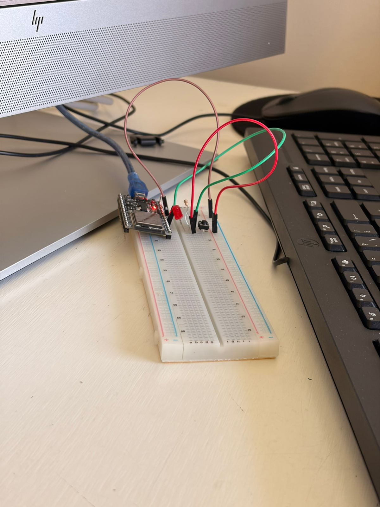
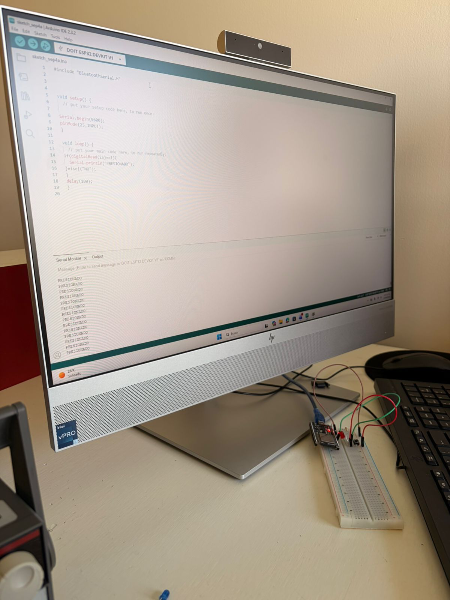
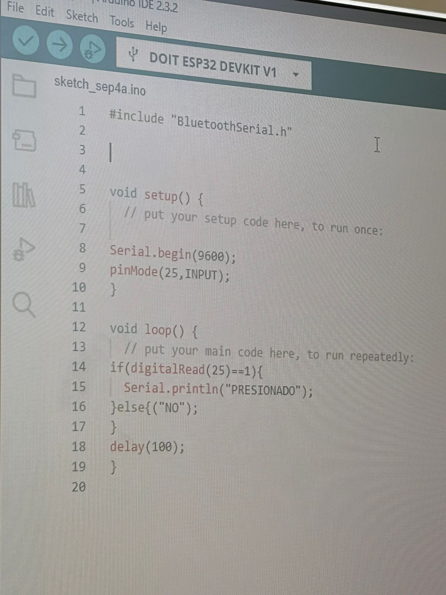
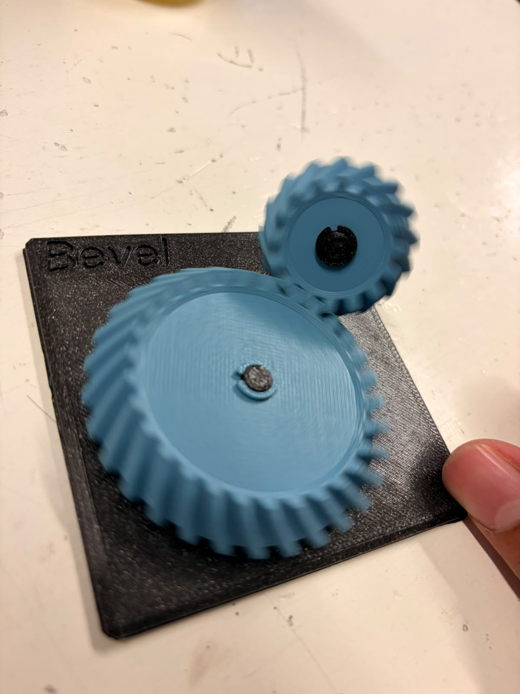
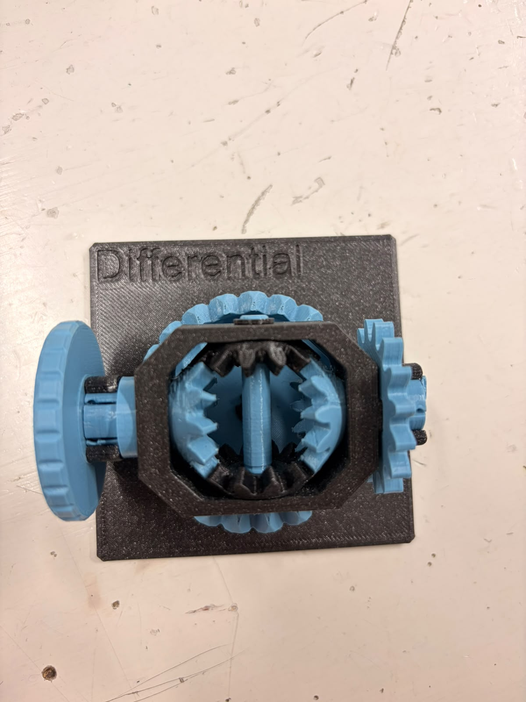
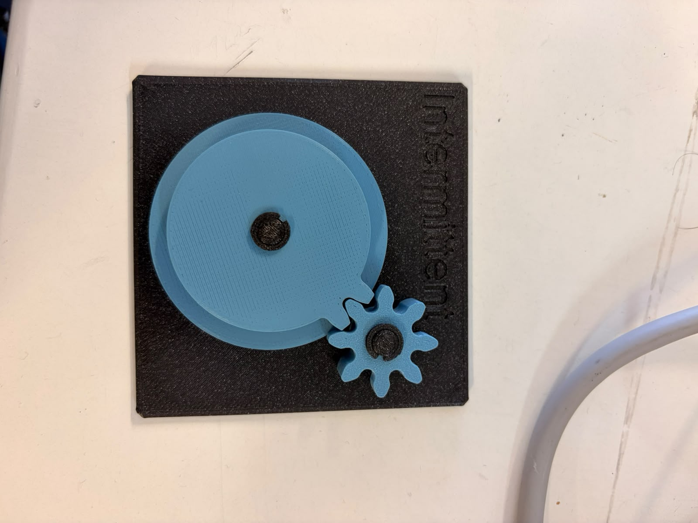
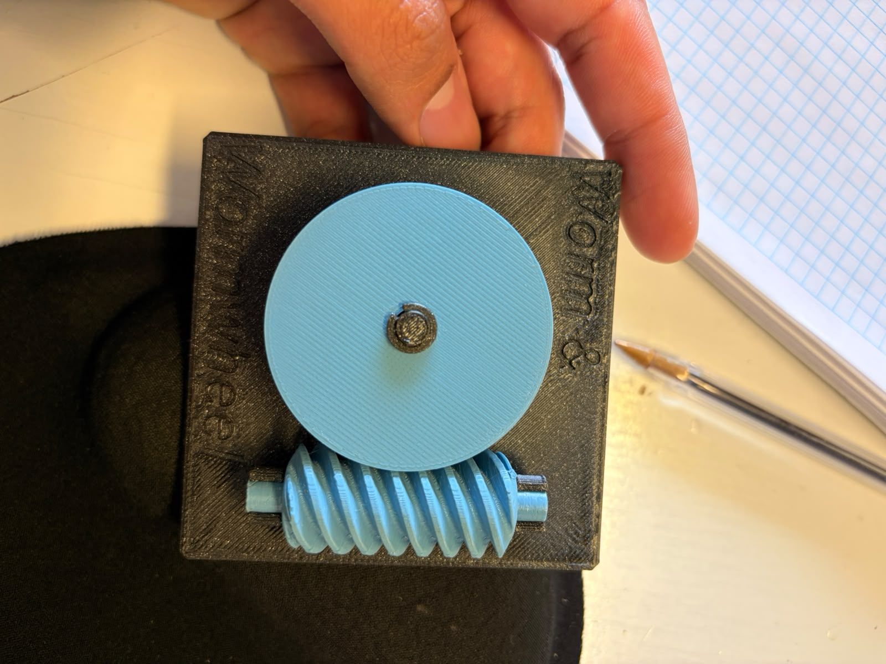
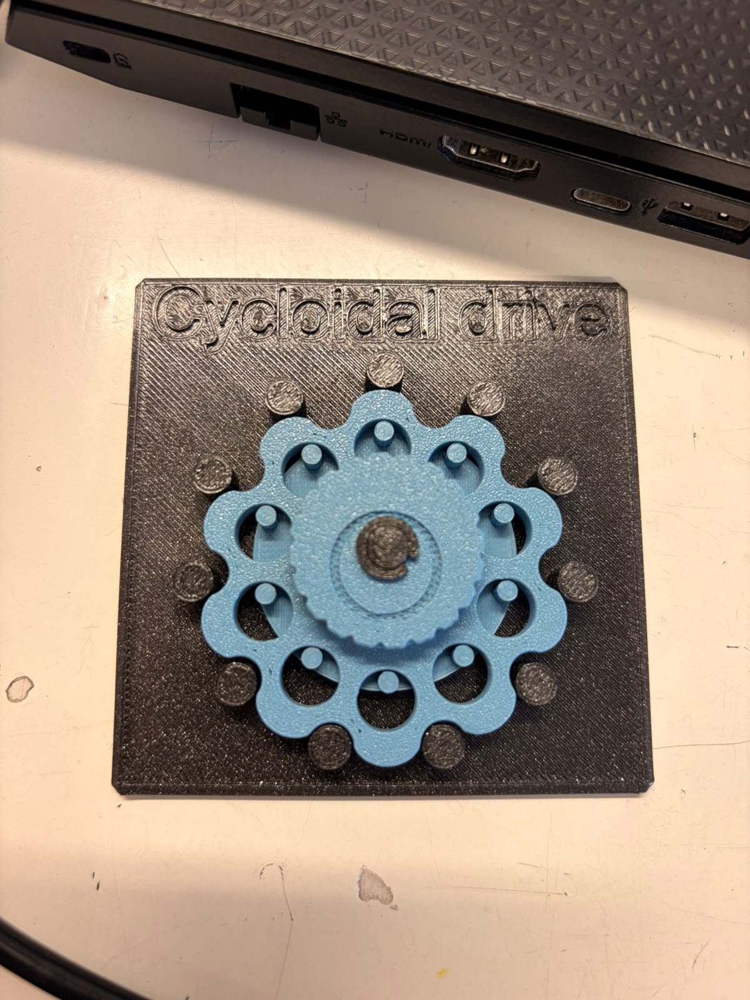
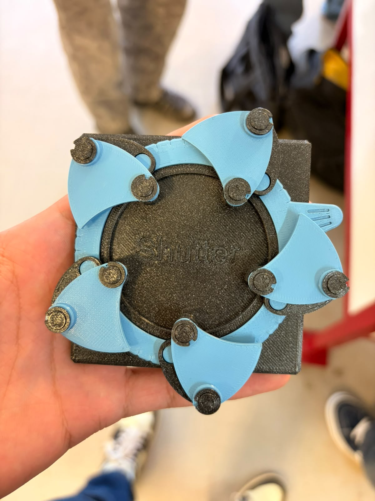
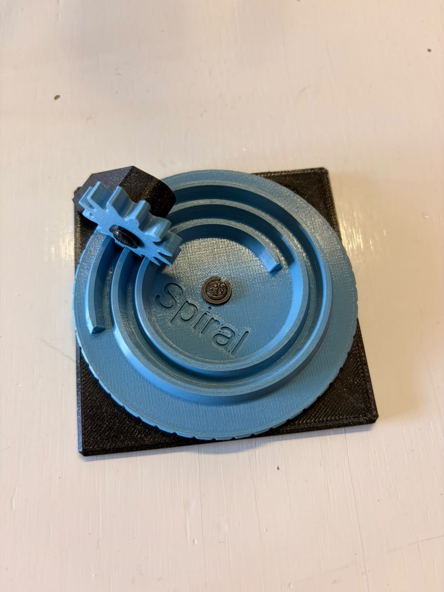

# Página de Sergio!!

**Bienvenido 👋**

---
Hola, soy Sergio, me gusta la música, resolver problemas, y tocar cualquier instrumento que pueda. 


---
**28 de agosto:** Creamos nuestro primer circuito con leds y resistencias. Tambien hicimos a un led parpadear y lo conectamos al osciloscopio para ver la electricidad en forma de gráfica.


Usamos 6 volts para el ledsito.


Agregué un led azul extra.


Circuito terminado :)

---
**4 de sept:** Conectamos un arduino ESP32 a protoboard, en donde conectamos un LED y programamos un código en Arduino IDE para que parpadera. Conectamos el celular de Oliver al arduino, ya que en nuestros dispositivos no fué exitosa la conexión.





#include "BluetoothSerial.h"
/voidsetup（）｛
/ put your setup code here, to run once:
Serial. begin(9600); pinMode (25, INPUT) ;
void loop() {
// put your main code here, to run repeatedly:
if(digitalRead(25)-==1)(
Serial. printIn ("PRESIONADO");
}else{("NO");
delay(100);


---
**11 sept:** Hoy usamos un motor DC y le dimos corriente. Luego en tinkercad conectamos un arduino a dos motores DC a una batería, donde los hicimos girar de un lado a otro, y le conectamos un servomotor para poder vizualizar la dirección y velocidad de los ejes del ambos motores. La prueba fué exitosa.


Este circuito utiliza un Arduino Uno para controlar dos motores DC mediante un integrado puente H L293D, alimentados por una batería de 9V. Además, incluye un servomotor conectado directamente a la tarjeta para funciones de dirección o posicionamiento.
Aquí el código:
```
// C++ code
//
#include <Servo.h>

Servo motor_1;

void adelante(){

  digitalWrite(6,HIGH);
  digitalWrite(7,LOW);
  digitalWrite(3,HIGH);
  digitalWrite(4,LOW);
}
void atras(){
  digitalWrite(7,HIGH);
  digitalWrite(6,LOW);
  digitalWrite(4,HIGH);
  digitalWrite(3,LOW);
}
void der(){
  digitalWrite(6,HIGH);
  digitalWrite(7,LOW);
  digitalWrite(4,HIGH);
  digitalWrite(3,LOW);
}
void izq(){
  digitalWrite(7,HIGH);
  digitalWrite(6,LOW);
  digitalWrite(4,HIGH);
  digitalWrite(3,LOW);
}


void setup()
{
 //SERVO
 motor_1.attach(9);
 //MOTOR1
 pinMode(6, OUTPUT);//OUT1
 pinMode(7, OUTPUT);//OUT2
 pinMode(5, OUTPUT);//ENABLE 
 //MOTOR2
 pinMode(4,OUTPUT);//OUT1
 pinMode(3,OUTPUT);//OUT2
 pinMode(2,OUTPUT);//ENABLE
  
  digitalWrite(5,HIGH);
  digitalWrite(2,HIGH);
}

void loop()
{
 motor_1.write(0);
 adelante();
 delay(1000);
 atras();
 delay(1000);
 motor_1.write(90);
 der();
 delay(1000);
 izq();
 motor_1.write(180);
 delay(1000);
}
```

---
**18 de sept:** 
1. Bevel: Cambio de eje (de horizontal a vertical a $90^\circ$) y velocidad a par.

Uso: Transmitir potencia entre ejes que se cortan.

Relación i estimada: Aprox. 2:1 (piñón pequeño de 12 dientes y rueda grande de 24 dientes).

Reversible o autobloqueante: Reversible.

Vida real: Taladros angulares y diferenciales automotrices.

Proyecto carro: Transmisión de fuerza desde un motor longitudinal hacia los ejes de las ruedas.



2. Diferencial: División de velocidad de rotación entre dos salidas a partir de una entrada común.

Uso: Permitir que dos ruedas en un mismo eje giren a distintas velocidades al tomar curvas.

Relación i estimada: 1:1 en línea recta; variable en curvas.

Reversible o autobloqueante: Reversible.

Vida real: Eje de tracción de cualquier automóvil o camión.

Proyecto carro: Eje trasero de un carro RC avanzado para evitar el derrape y el desgaste excesivo de llantas.



3. Intermittent (Intermitente): Movimiento rotatorio continuo a movimiento rotatorio intermitente (con pausas).

Uso: Generar avances por pasos o ciclos con tiempos de reposo.

Relación i estimada: Variable por ciclo (gira un sector y luego se bloquea temporalmente).

Reversible o autobloqueante: No es reversible (se bloquea si se fuerza desde la salida).

Vida real: Relojería mecánica (calendarios) y mecanismos de indexación industrial.

Proyecto carro: Sistema dispensador automático de objetos o mecanismo de disparo periódico en un robot de competencia.



4. Worm & Wheel (Tornillo sin fin): Alta reducción de velocidad a par (torque) extremo + cambio de eje a 90°.

Uso: Reducir velocidad drásticamente y multiplicar el torque en espacios reducidos.

Relación i estimada: Alta, aprox. 20:1 (el tornillo da 20 vueltas por cada vuelta de la rueda).

Reversible o autobloqueante: Autobloqueante (el tornillo puede mover la rueda, pero la rueda no puede mover al tornillo).

Vida real: Mecanismos de dirección y compuertas automáticas.

Proyecto carro: Sistema de dirección (servo con tornillo sin fin para mantener las ruedas firmes sin gastar energía) o un winche (grúa) de rescate.



5. Cycloidal Drive (Reductor Cicloidal): Reducción masiva de velocidad a torque con alta precisión y cero juego.

Uso: Reducción de velocidad compacta con máxima rigidez torsional.

Relación i estimada: Muy alta (usualmente superior a 30:1).

Reversible o autobloqueante: Autobloqueante debido a su alta fricción interna.

Vida real: Juntas de brazos robóticos industriales y actuadores de alta precisión.

Proyecto carro: Articulación de alta fuerza en un brazo robótico móvil o en la tracción de un rover todoterreno.



6. Shutter (Obturador / Diafragma): Rotación de un anillo en apertura y cierre radial coordinado.

Uso: Controlar el paso de luz o regular el diámetro de una abertura de forma simétrica.

Relación i estimada: 1:1 respecto al giro del anillo de control.

Reversible o autobloqueante: Reversible.

Vida real: Diafragma de cámaras fotográficas e iris ópticos.

Proyecto carro: Garra robótica o pinza tipo iris capaz de envolver y asegurar objetos redondos.



7. Spiral (Espiral): Movimiento rotatorio continuo a desplazamiento radial variable.

Uso: Desplazar un seguidor a distancias variables dependiendo del ángulo de giro.

Relación i estimada: Variable a lo largo del recorrido de la espiral.

Reversible o autobloqueante: No reversible fácilmente (tiende a atascarse por la fricción radial).

Vida real: Antiguos mecanismos de sintonización de radio y levas de posicionamiento.

Proyecto carro: Mecanismo de geometría variable (como abrir paneles o modificar la altura del chasis de forma escalonada).




## Empezar rápido (3 pasos)

1. **Edita el nombre del sitio** en `mkdocs.yml`:
   ```yaml
   site_name: Documentación del Curso
   theme: yellow
     name: material